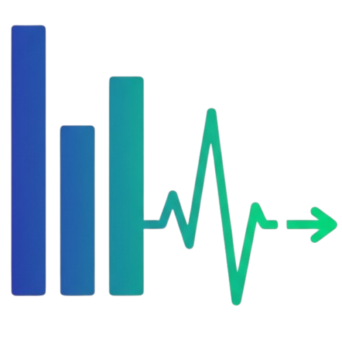
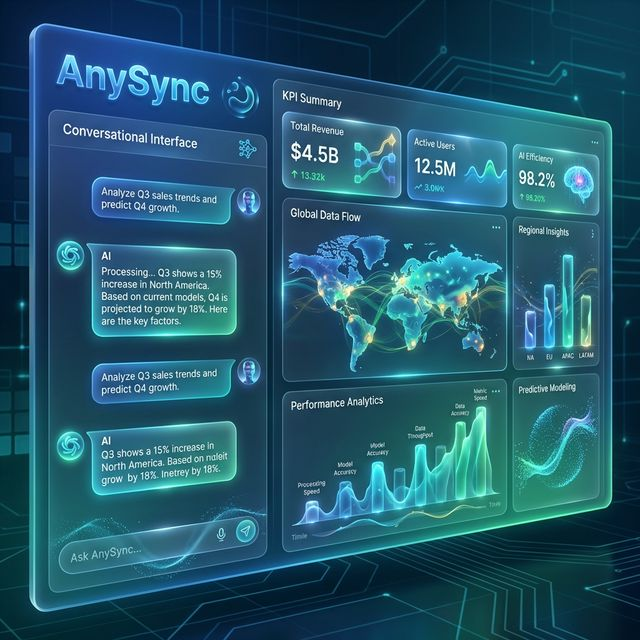

# <p align="center"><br>AnySync</p>

<p align="center">
  <strong>Agentic AI Enterprise Orchestration Platform</strong><br>
  <em>Don't just view data. Converse with it.</em>
</p>

<p align="center">
  
  
  
  
</p>

<p align="center">
  
</p>

<p align="center">
  <a href="#-core-pillars">Features</a> •
  <a href="#-architecture">Architecture</a> •
  <a href="#-technology-stack">Tech Stack</a> •
  <a href="#-security--compliance">Security</a> •
  <a href="#-getting-started">Usage</a>
</p>

---

## 🚀 The Vision

AnySync is a next-generation **Autonomous Enterprise AI Agent Platform** that transforms how organizations interact with data, systems, and processes. Unlike traditional BI tools that merely visualize data, AnySync deploys autonomous AI agents that can **plan, reason, execute multi-step tasks, and collaborate** across your entire enterprise ecosystem.

> "AnySync is the universal hub where AI agents from every vendor, every framework, and every protocol meet to autonomously execute enterprise tasks — with full human oversight, security, and auditability."

---

## ✨ Core Pillars

| Pillar | Capability | Outcome |
|:---:|---|---|
| **Conversational BI** | Natural language queries for clinical & financial data. | **Zero-SQL** analytics for everyone. |
| **Agentic Actions** | Prescriptive orchestrator recommends and executes workflows. | **Autonomous** operational task management. |
| **Deep Analytics (RAG)** | Agentic, Graph, and Multimodal retrieval patterns. | **Hallucination-free** enterprise intelligence. |
| **Universal Federation** | Interop with Copilot, AgentForce, and ServiceNow via A2A/MCP. | **No vendor lock-in**; every ecosystem connected. |
| **Visual Reporting** | Generative UI transforms chat threads into live dashboards. | **Instant** executive-ready presentations. |

---

## 🏗 Architecture

AnySync follows a robust **Three-Plane Architecture** designed for security and scalability:

### 1. Data Plane (Read-Only)
- Strictly read-only access to legacy systems (ERP, HIS, SAP, etc.).
- Direct database connectivity via **FastMCP** servers.
- AI agents use the `AnySync_readonly` role for absolute safety.

### 2. Intelligence Plane (Orchestration)
- Powered by **Google Genkit** and **CopilotKit**.
- Multi-agent orchestration with explicit input/output contracts.
- Advanced RAG patterns (Agentic, Corrective, Graph).
- Built-in PII redaction using **Presidio**.

### 3. Action Plane (HITL)
- **Human-In-The-Loop (HITL)** mandatory for all external write-backs.
- Every AI-driven decision is logged to an immutable **Audit Log**.
- Actionable recommendations with one-click human approval.

---

## 🛠 Technology Stack

### Backend (Go Engine)
- **Runtime:** Go 1.26+ (Clean Architecture)
- **API:** `go-chi` for routing
- **Persistence:** `sqlx` for warehouse access
- **Message Bus:** NATS JetStream

### Frontend (Liquid Glass UI)
- **Web:** React 19 + Vite + Vanilla CSS (Premium Aesthetics)
- **Mobile:** Flutter 3.42+ (Offline-first via PowerSync)
- **Generative UI:** CopilotKit integration
- **Design:** Modern glassmorphism, smooth gradients, micro-animations

### AI & Intelligence
- **Frameworks:** Google Genkit, Anthropic MCP, Google ADK
- **Models:** Gemini 2.0, Claude 3.5, GPT-4o (Provider Agnostic)
- **Security:** OWASP Top 10 for LLM compliance

---

## 🛡 Security & Compliance

AnySync is built for the most regulated industries (Healthcare & Finance):
- **PII Protection:** Real-time masking based on user roles.
- **Compliance Frameworks:** Designed for HIPAA, SOC2, GDPR, and the EU AI Act.
- **Audit Trails:** Immutable logging for every agent interaction.
- **Provider Agnostic:** Run locally (Ollama) or via secure enterprise gateways.

---

## 🏁 Getting Started

### Prerequisites
- Node.js 22+
- Go 1.26+
- Redis 7.4+
- NATS Server

### Installation
```bash
git clone https://github.com/your-org/anysync.git
cd anysync
npm install
npm run dev
```

---

## 📄 License

This project is licensed under the Apache License 2.0 - see the [LICENSE](LICENSE) file for details.

---

<p align="center">
  Built with ❤️ by the AnySync Advanced AI Team
</p>
