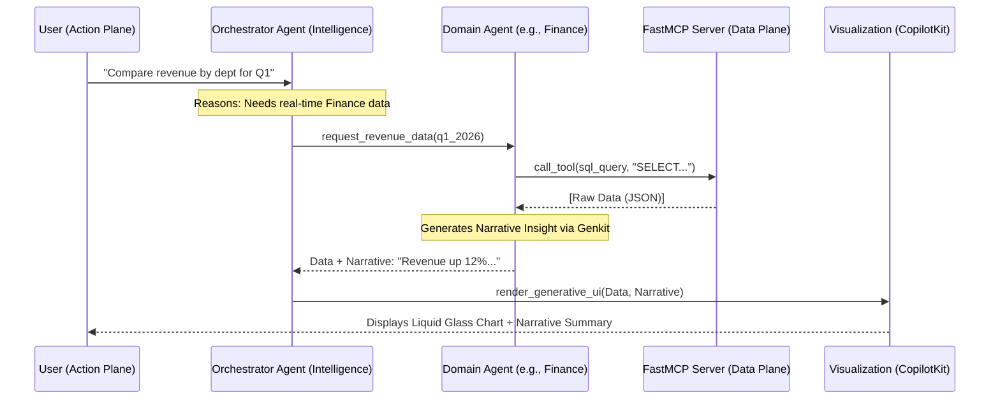
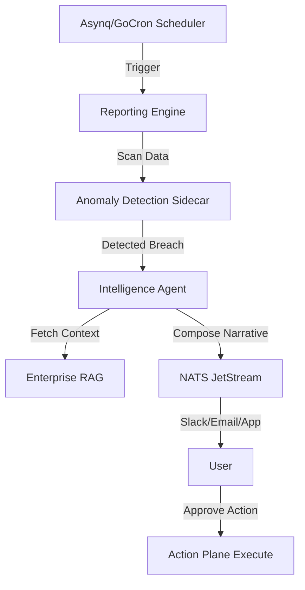
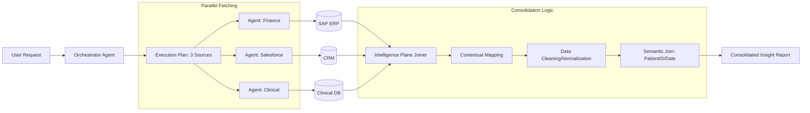

# AnySync Data Flows: Agentic Reporting Architecture

This document details the architectural data flows for AnySync's reporting and analytics system, following the AnySync 3-Plane Architecture (Action, Intelligence, Data).

---

## 1. Architectural Overview

AnySync reporting is built on an **Agentic Orchestration** model. Instead of static pipelines, it uses autonomous agents to reason about user intent, fetch contextual data, and generate dynamic presentations.

### The 3-Plane Alignment
- **Action Plane (Web/Mobile)**: Generates the UI using **CopilotKit** and handles the "Human-in-the-Loop" (HITL) approvals.
- **Intelligence Plane (Genkit/Go)**: The brain. Orchestrates multi-agent handoffs, performs RAG analysis, and determines visualization strategy.
- **Data Plane (Postgres/Redis/MCP)**: The system of record. Provides secure, read-only access to enterprise data via **FastMCP** for real-time SQL synthesis.

---

## 2. Core Flow: Conversational Reporting (On-Demand)

This flow occurs when a user asks a specific question through the natural language interface.

### Sequence Diagram

### Steps in Detail:
1.  **Request Capture**: User provides NL input. The **Action Plane** (React/CopilotKit) captures the context.
2.  **Intent Orchestration**: The **Orchestrator Agent** (Go/Genkit) breaks the request into a plan. It routes sub-tasks to specialized domain agents (e.g., Clinical Agent, Finance Agent).
3.  **Secure Data Fetching**: Agents interact with **FastMCP Servers**. 
    - **FastMCP Protocol**: Enables dynamic tool discovery and execution for direct database interaction without intermediate APIs.
    - **Security Rule**: Every query uses a `AnySync_readonly` database role.
    - **Privacy Rule**: **Microsoft Presidio** sidecars mask PII before the data reaches the Intelligence Plane.
4.  **Analysis & Synthesis**: Domain agents don't just return data; they return **Narrative Insights** generated via Genkit (e.g., "Cardiology is up 15%, likely due to high cardiac camp volume").
5.  **Generative Presentation**: **CopilotKit** maps the generic JSON data to specific "Liquid Glass" generative UI components (Charts, Tables, narrative summaries).

---

## 3. Autonomous Flow: Proactive & Scheduled Reports

This flow handles reports that run without direct user triggers (e.g., daily digests or anomaly-triggered alerts).

### Key Components:
- **Asynq (Redis-backed)**: Manages distributed cron jobs for thousands of organization-specific schedules.
- **Anomaly Detection Sidecar**: A lightweight Go routine that scans metrics for deviations beyond 2 standard deviations.
- **NATS JetStream**: Ensures at-least-once delivery of notifications to users across devices.

---

## 4. Multi-System Integration (Agent Federation)

AnySync doesn't just query its own database. It can federate requests to external enterprise agents.

| Integration Type | Protocol | Use Case |
| :--- | :--- | :--- |
| **External Agent** | **A2A / MCP** | Querying SAP Joule for inventory or Salesforce AgentForce for pipeline. |
| **Direct Database** | **FastMCP** | Connecting to legacy SQL Server or Oracle warehouses without ETL. |
| **Enterprise RAG** | **Vector API** | Searching PDFs/Policies in SharePoint via pgvector. |

### Federation Data Flow:
1.  **Orchestrator** identifies that data resides in **Salesforce**.
2.  **Orchestrator** issues an **MCP Tool Call** to the Salesforce MCP Server.
3.  **Salesforce MCP** authenticates via **OIDC (Authelia)** and fetches the record.
4.  **AnySync Intelligence Plane** joins the Salesforce data with local Postgres data.
5.  **Result**: A unified report showing "Sales Pipeline vs. Resource Availability" in one chart.

---

## 5. Security & Reliability Model

Designed to be **Secure, Robust, and Reliable**.

### Zero Trust Data Access
- **Read-Only Enforcement**: The Intelligence Plane has no write-access to core databases.
- **Audit Logging**: Every agent plan, tool call, and data access event is logged to the immutable `audit_log`.

### Resilience Patterns
- **Semantic Caching**: Common reporting queries are cached in **Redis 7.4+** to reduce LLM overhead and latency.
- **Circuit Breakers**: If an external MCP server (e.g., SAP) is down, the Orchestrator provides a graceful fallback (e.g., "Using last cached data from 2 hours ago").
- **HITL (Human-in-the-Loop)**: Any "correction" report (e.g., "Adjust inventory after audit") requires explicit user tap-to-approve in the Action Plane.

---

## 6. Presentation Excellence (Liquid Glass)

Reports are delivered with the **iOS 26 Liquid Glass** design identity.

- **Downloadable Formats**: High-DPI PDF, Excel with formulas, and SVG for presentations.
- **Micro-Animations**: Charts animate on entrance to guide the user's eye to key variances.
- **Glassmorphism**: UI surfaces use blur-behind and subtle gradients to maintain a premium feel.

---

## 7. Multi-System Consolidation (The "Unified Lens")

AnySync's core strength is its ability to perform **Cross-System Joins** in the Intelligence Plane without requiring a central data warehouse.

### Consolidation Workflow

### Technical Implementation:
1.  **Semantic Mapping**: The Orchestrator uses its knowledge of the enterprise schema to identify common keys (e.g., `Patient_ID` in Clinical vs. `Customer_ID` in CRM) and maps them semantically.
2.  **Parallel Execution**: To maintain performance, AnySync launches concurrent agent sessions to fetch data through respective MCP servers.
3.  **In-Memory Aggregation**: The Intelligence Plane (Genkit/Go) acts as a high-performance join engine, merging JSON payloads based on the reasoned plan.
4.  **Graceful Degeneracy**: If one system (e.g., CRM) is slower, the Orchestrator can stream partial results or provide a "Draft" status while waiting for the final consolidation.

---
*Created by Antigravity Architect - Feb 25, 2026*
